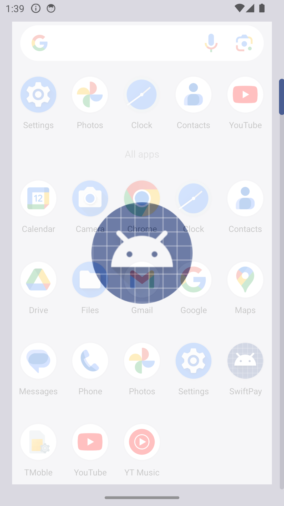
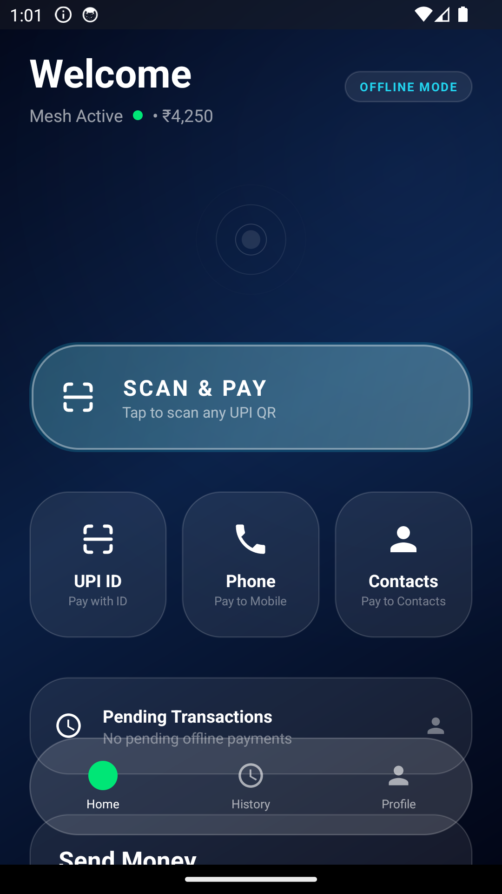
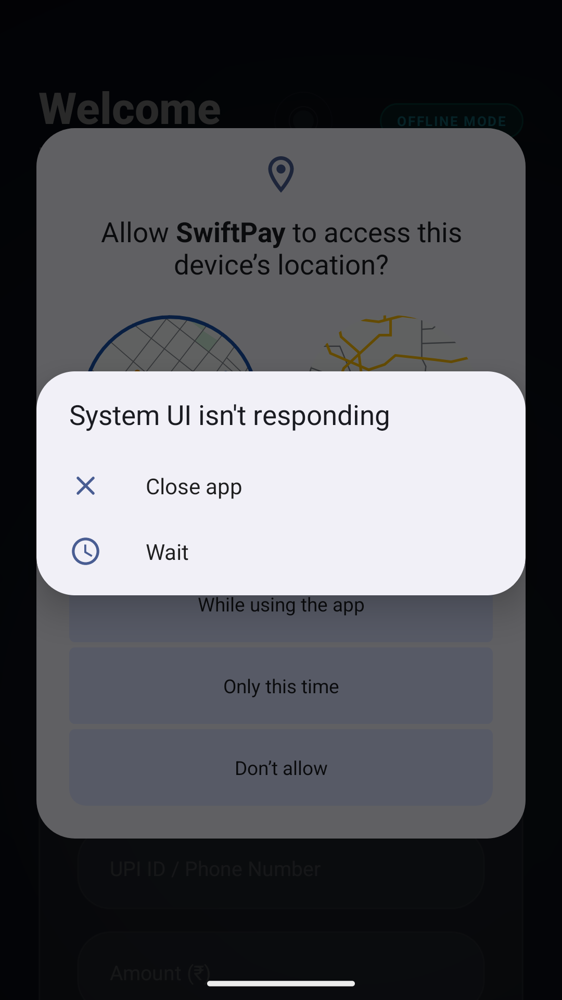

# SwiftPay — Neon Liquid Glass Offline Payments 💎⚡

SwiftPay is a premium, high-end fintech application designed to enable **Offline UPI Payments** in areas with zero connectivity. Built with a futuristic **Neon Glassmorphism** aesthetic, it combines military-grade security with an iOS-level "Liquid Glass" user experience.

## 🌟 Key Features

### 1. **Liquid Glass Navigation** 🌊
A state-of-the-art navigation system using heavy backdrop blur, light diffusion, and glow-pulse animations. The interface feels alive, with content gracefully blurring behind a frosted glass pill.

### 2. **P2P Offline Mesh Network** 📡
Uses Bluetooth & WiFi-Direct to gossip encrypted payment packets across devices. Your payment can travel through 10 offline phones until it finds one with internet (The Bridge) to settle the transaction.

### 3. **Military-Grade Security** 🔒
*   **Asymmetric Encryption**: RSA-2048 public keys for cloud-only decryption.
*   **Tactile PIN Entry**: A custom frosted glass keypad with haptic-simulated animations for secure local authorization.

### 4. **Visual Real-Time Feedback** 🎯
Includes a custom **Mesh Radar** view that pulses in real-time as peers are discovered in your local offline vicinity.

---

## 📸 Interface Preview

| Home Dashboard | PIN Security | Mesh Radar |
| :---: | :---: | :---: |
|  |  |  |

---

## 🛠️ Technology Stack

*   **Android Client**: Native Java, Custom View Canvas, Dynamic Spring Animations, Fragment-based modular routing.
*   **Backend**: Spring Boot 3.2, PostgreSQL (via Neon.tech), Twilio SMS Gateway.
*   **Infrastructure**: Dockerized microservice architecture, ready for Render.com deployment.

---

## 🚀 Quick Setup

### **Backend (Cloud)**
1.  Navigate to `/server`.
2.  Deploy using the provided `render.yaml` blueprint.
3.  Configure `SPRING_DATASOURCE_URL` from your Neon.tech console.

### **Android App**
1.  Open `/client` in Android Studio.
2.  Update `SERVER_URL` in `MainActivity.java`.
3.  Build and install on any device with Bluetooth support.

---

## 🎨 Design Philosophy
SwiftPay follows a **Depth-Layering** system:
*   **Layer 0**: Deep Navy Mesh Gradient (Animated).
*   **Layer 1**: Frosted Glass Cards (14% Diffusion).
*   **Layer 2**: Liquid Navigation (40% Frosting + Scrim Masking).

---

Developed with ❤️ for the future of offline finance.
